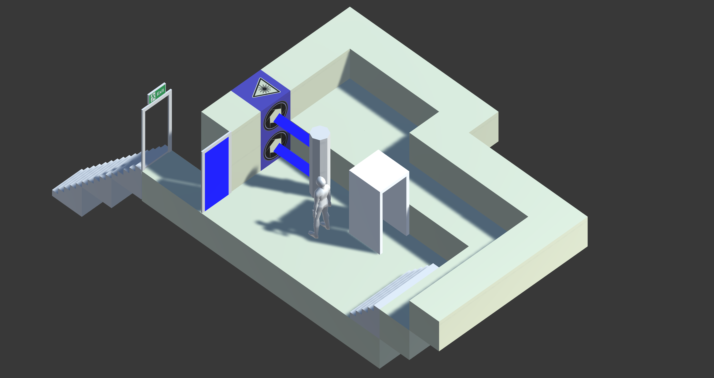

# Tetromino
Tetromino is a 3D puzzle platforming game that I am creating as my 
final project for my CPI 211 course at Arizona State University. The
objective of the game is to interact with a variety of devices and
gameplay mechanics to reach the end of each level. The game is a work
in progress at the moment.

